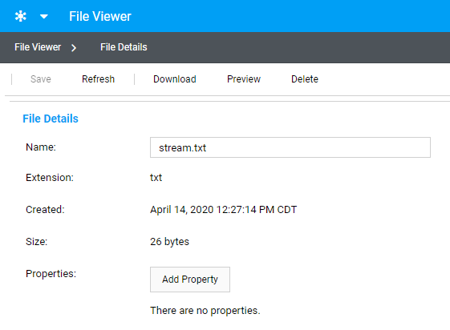

File Stream Example
=================

This is an example console application demonstrating how to use the
SystemLink File API to upload files from an in-memory stream.

Running the Example
-------------------

1. Download and extract the [repository source](https://github.com/ni/systemlink-client-docs/archive/master.zip).
2. Install the [.NET Core SDK](https://dotnet.microsoft.com/download/dotnet-core).
3. Navigate to the example's directory and use the [`dotnet run` command](https://docs.microsoft.com/en-us/dotnet/core/tools/dotnet-run?tabs=netcore21).

To run the example, use the following command:

```
dotnet run -- --server <url> <username> <password>
```

For example: `dotnet run -- --server https://my_server admin "my password"`.

About the Example
-----------------

This example uploads a single file to the SystemLink server. The File client API uploads the file contents directly from an in-memory stream. This has the advantage that the file does not need to be written to disk on the client before being uploaded to the server.  A name can be provided for the stream upload which is used as the file name on the server.

### Sample output

The files uploaded to the SystemLink server can be viewed in the [File Web Application](https://localhost/#fileviewer). The file details can be explored using a web browser:


Certain file types, such as .txt, .png, or .pdf, can be previewed in the browser.
