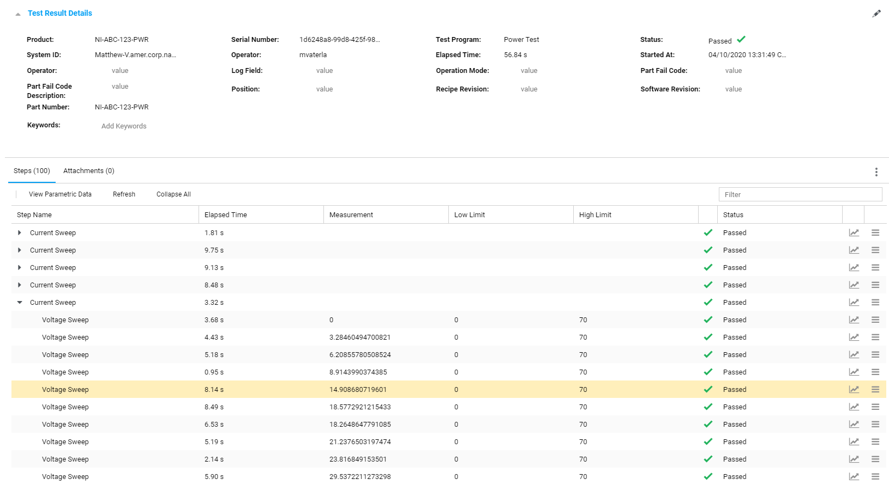
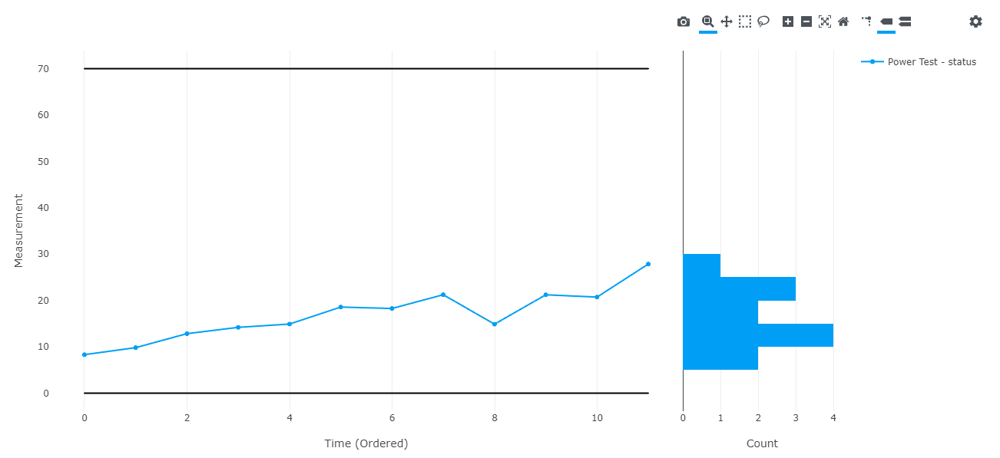

Test Monitor Results Example
=================

This is an example console application demonstrating how to use the
SystemLink Test Monitor API to create test results and steps.

Running the Example
-------------------

1. Download and extract the [repository source](https://github.com/ni/systemlink-client-docs/archive/master.zip).
2. Install the [.NET Core SDK](https://dotnet.microsoft.com/download/dotnet-core).
3. Navigate to the example's directory and use the [`dotnet run` command](https://docs.microsoft.com/en-us/dotnet/core/tools/dotnet-run?tabs=netcore21).

To run the example, use the following command:

```
dotnet run -- --server <url> <username> <password>
```

For example: `dotnet run -- --server https://my_server admin "my password"`.

About the Example
-----------------

This example creates a single test result that simulates a power test.  It sweeps over a range of electrical current and voltage input values and calculates the electrical power output (P=IV).  Each current and voltage combination is recorded as a test step in a nested heirarchy.

The example shows how to create a test result and associated metadata.  The steps are then associated with the test result and child steps are associated with their parent step.

The example shows how to use the `TestStand` data model for creating step measurements that render their inputs and outputs in the web interface.

The example also shows how to use some additional features of the API to automatically update the result's total time and determine the result's status from it's child steps.

### Sample output

The data published to the SystemLink server can be viewed in the [Test Monitor Web Application](https://localhost/#testmonitor).  The test result details and the assocaited steps can be explored using a web browser:


The test step measurements can be analyzed in the SystemLink Test Monitor parametric data view:
